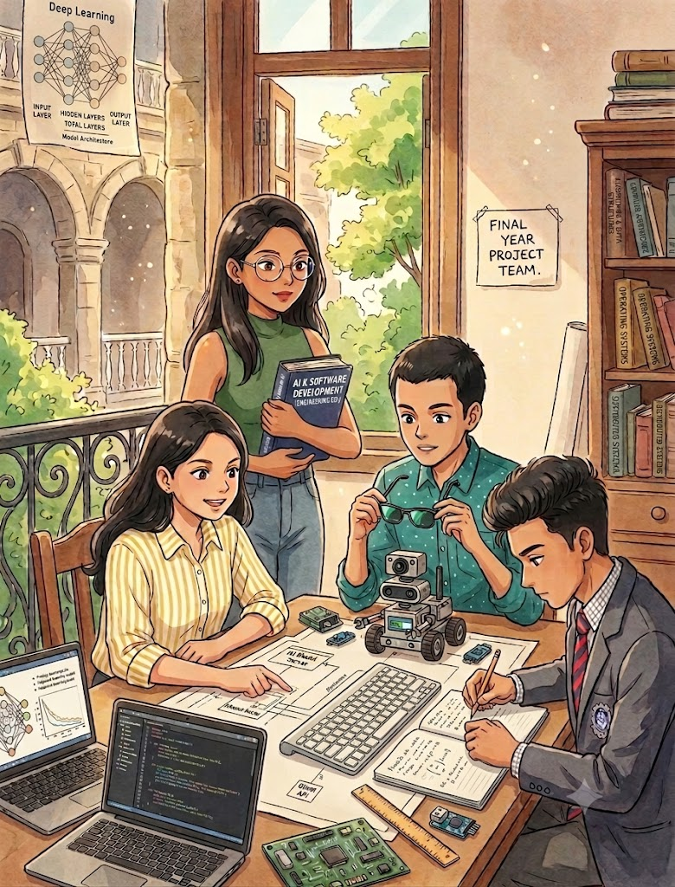

  <!-- Interactive Holographic Team Intro -->
  

    

  <!-- Title & Description are integrated into the main image, but kept here for accessibility and structure -->
  <h1>🚀 Final Year Team</h1>
  
  
<b>💡 Building innovative AI-powered solutions | 👨‍💻 Code • Build • Innovate • Learn | 📍 India</b>

 

## 🎓 About Us
We are a dedicated group of final-year engineering students from **Savitribai Phule Pune University (SPPU)**, representing **Guru Gobind Singh College of Engineering and Research Centre (GCOERC), Nashik**. We are focused on solving real-world problems through innovative technology.

*(All Team details, Guidance, Domains, and Tech are present and readable within the animated holographic image above.)*

---

  <i>"Code • Build • Innovate • Learn"</i>

